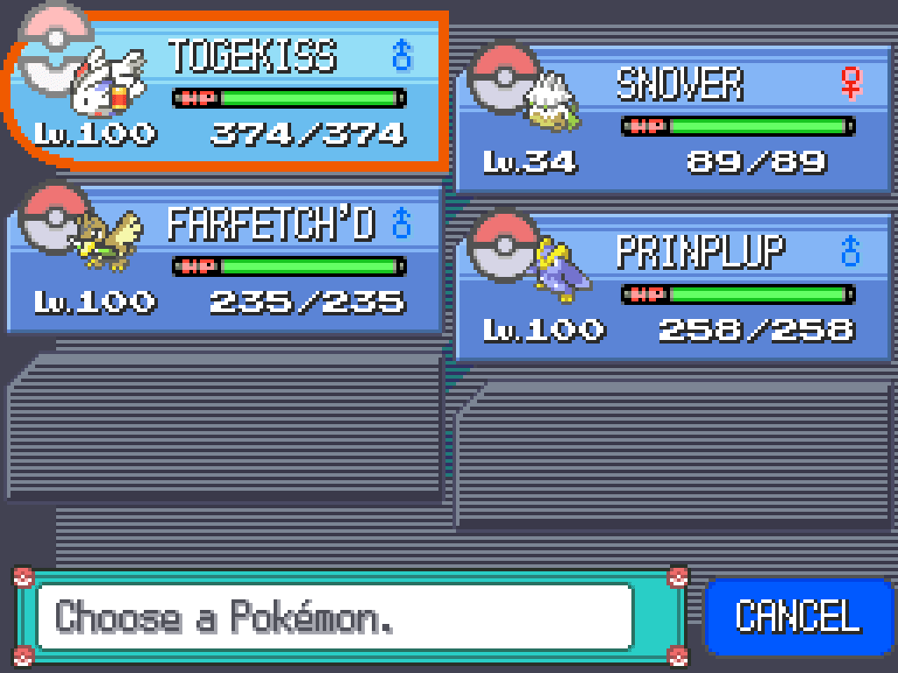
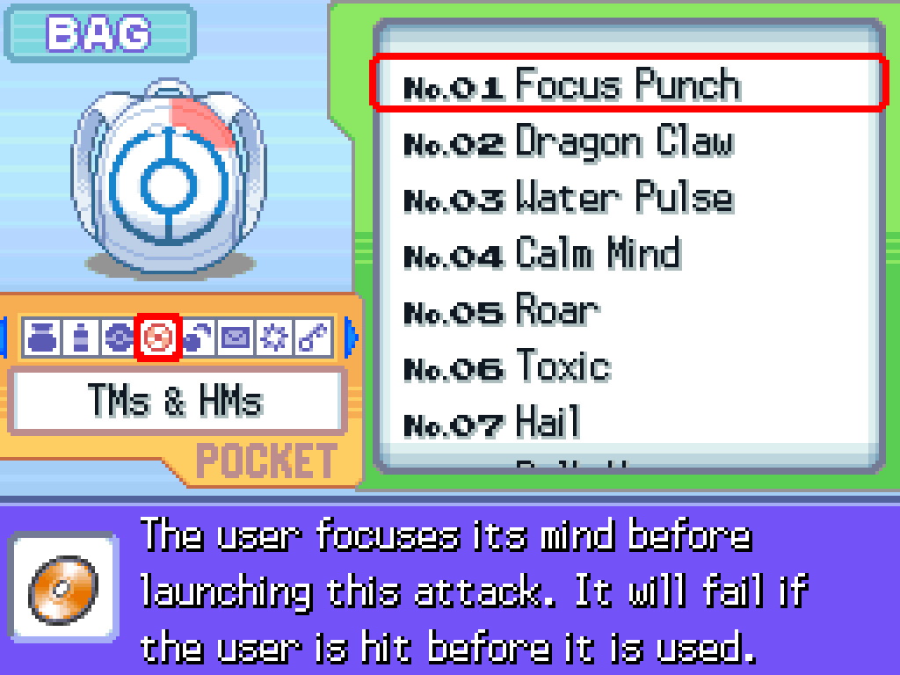
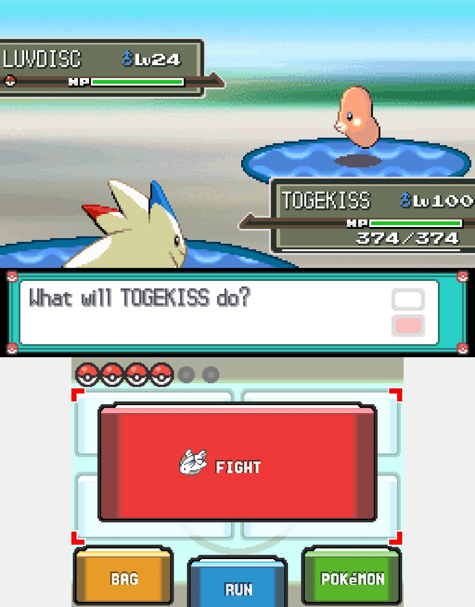
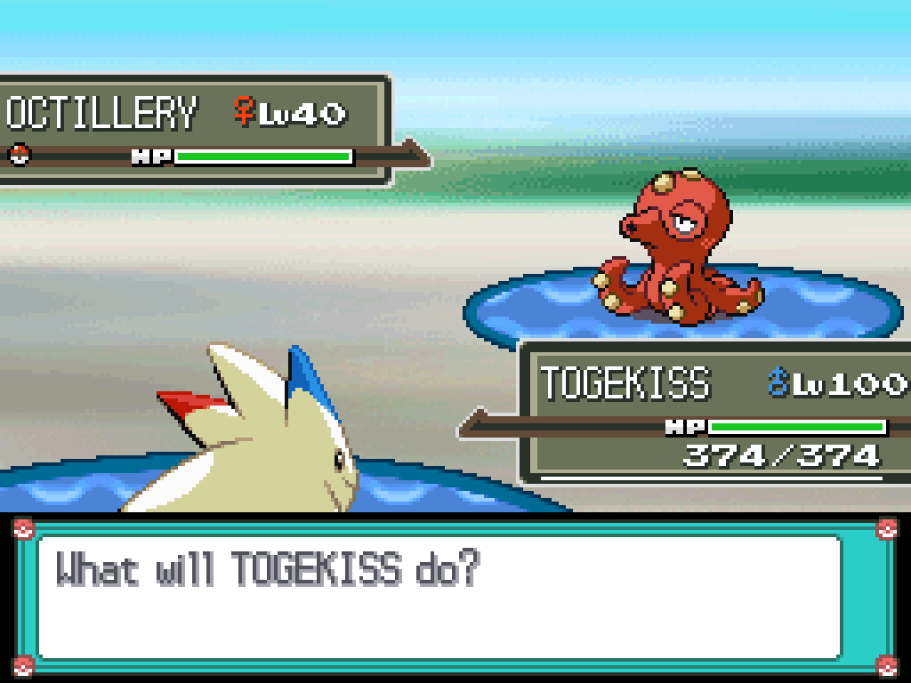

# Platinum QOL Features

This repository contains a host of QOL features that can be applied to Pokemon Platinum via C injection. Code written herein is based on the US version of Pokemon Platinum, specifically Rev 1.

This repository is also structured to be extensible as a C injection template with the requisite infrastructure already set up for an aspiring hacker.

## Table of Contents

- [Features](#features)
- [Setup Instructions](#setup-instructions)
  - [Windows](#windows)
  - [Mac OSX](#mac-osx)
  - [Linux](#linux)
- [Build Instructions](#build-instructions)
- [Credits](#credits)

## Features

- Summary Screen with IVs, EVs, and Nature Highlighting

 

Press **R** to change to IVs, **L** to change to EVs, and **SELECT** to change to actual stats.

- Unlimited TMs

 

- HM Usage Based on Possession

 

- Press B to RUN in a Wild Battle

 

- Faster HP Bar Drain

 

## Setup Instructions

### Windows

Windows builds are based on WSL. If you do not have WSL set up (or do not know if you do), follow the instructions in [Setting up WSL](#setting-up-wsl) below.

If you already have a WSL environment set up, proceed to [Further Instructions](#further-instructions).

#### Setting up WSL

1. Enable Windows Subsystem for Linux.
    1. Open your command prompt as Administrator.
        1. In the search bar in the Start Menu, search for "cmd".
        1. Right-click on **Command Prompt**.
        1. Click **Run as Administrator**.
    1. Run the following command: `dism.exe /online /enable-feature /featurename:Microsoft-Windows-Subsystem-Linux /all`.
    1. After the process completes, you will be prompted to restart your PC. Type "Y" and press **Enter** to restart.
    1. During the reboot process, enable virtualization in your BIOS.
        - The exact steps here will vary by system and the exact make/model of your PC's motherboard. You can find a general sketch of instructions [here](https://bce.berkeley.edu/enabling-virtualization-in-your-pc-bios.html).
1. Install Ubuntu.
    1. In the search bar in the Start Menu, search for "store" and open **Microsoft Store**.
    1. In the search bar of the window that opens, search for "Ubuntu".
    1. Click the blue **Get** button.
    1. Once installation is complete, launch Ubuntu from its page in the Microsoft Store to finish setup.
        - This will start a setup procedure that may take some time to complete.
    1. Once the setup procedure is complete, choose a username and password for the system.
1. Open WSL.
    1. Open the **Run** window by pressing the **Windows Key** and **R** at the same time.
    1. Type `wsl` into the window and press **Enter**.
1. Update WSL.
    1. In WSL, type `sudo apt update` and press **Enter**.
    1. After the update process completes, type `sudo apt upgrade` and press **Enter**.
        - This process may take a long time.
        - You may be prompted to confirm that WSL should restart automatically during package updates. Select **Yes** and press **Enter**.

#### Further Instructions

1. Download and install devkitPro-pacman.
    - In WSL, run the following commands:
        1. `wget https://apt.devkitpro.org/install-devkitpro-pacman`
        1. `chmod +x ./install-devkitpro-pacman`
        1. `sudo ./install-devkitpro-pacman`
1. Install necessary packages.
    - In WSL, run the following commands:
        1. `sudo apt-get install build-essential git libpng-dev gdebi-core python3 python3-pip cmake automake`
        1. `pip3 install ndspy`
        1. `dkp-pacman -S gba-dev`
1. Restart WSL, then run the following commands.
    1. `export DEVKITPRO=/opt/devkitpro`
    1. `echo "export DEVKITPRO=$DEVKITPRO" >> ~/.bashrc`
    1. `export DEVKITARM=$DEVKITPRO/devkitARM`
    1. `echo "export DEVKITARM=$DEVKITARM" >> ~/.bashrc`
    1. `cd Documents`
    1. `git clone https://github.com/lhearachel/plat-qol.git`
        - This will create a new directory `plat-qol`, which will be short-handed as "the project directory" from hereon.

### Mac OSX

TBD

### Linux

#### Debian-based (e.g. Debian, Ubuntu, Linux Mint)

1. Download and install devkitPro-pacman.
    - Follow the instructions listed [here](https://github.com/devkitPro/pacman/releases).
1. Install necessary packages.
    - In Terminal, run the following commands:
        1. `sudo apt install libpng-dev build-essential cmake python3-pip git automake`
        1. `pip3 install ndspy`
        1. `dkp-pacman -S gba-dev`

#### Arch-based (e.g. Arch Linux, Endeavour)

1. Import keys for devkitPro's repository.
    - Follow the instructions listed [here](https://devkitpro.org/wiki/devkitPro_pacman#Customising_Existing_Pacman_Install).
1. Install necessary packages.
    - In Terminal, run the following commands:
        1. `sudo pacman -S libpng base-devel cmake python-pip git automake gba-dev`
        1. `pip3 install ndspy`

#### Further Instructions (Platform Agnostic)

1. Restart Terminal, then run the following commands.
    1. `export DEVKITPRO=/opt/devkitpro`
    1. `echo "export DEVKITPRO=$DEVKITPRO" >> ~/.bashrc`
    1. `export DEVKITARM=$DEVKITPRO/devkitARM`
    1. `echo "export DEVKITARM=$DEVKITARM" >> ~/.bashrc`
    1. `cd Documents`
    1. `git clone https://github.com/lhearachel/plat-qol.git`
        - This will create a new directory `plat-qol`, which will be short-handed as "the project directory" from hereon.

## Build Instructions

1. Setup your ROM.
    - Your base ROM *must* be a verified dump of **Pokemon Platinum (US)**.
    - Perform any and all edits to scripts, maps, events, etc. to your ROM *before* you install this repository.
1. Place your ROM.
    - Place your finalized ROM into the project directory and rename it to `rom.nds`.
1. Navigate to the project directory in Terminal/WSL.
1. Download and build necessary tools.
    - Run `make build_tools -j$(nprocs)`. This process will download the source code for tools needed by the injection routine and compile them for you.
1. Make your ROM.
    - Run `make -j$(nprocs)`.
1. Test your ROM.
    - After the previous `make` process completes, a new file will appear in this folder named `test.nds`. This ROM will contain all injected routines and modifications from this project.
    - The `test.nds` ROM should be judged as the *final* copy of your ROM for any patch-creation routines! Do *not* attempt to modify it!

## Credits

- [**Skeli789** (Complete Fire Red Upgrade Engine)](https://github.com/Skeli789/Complete-Fire-Red-Upgrade)
- [**Mikelan98 and Nomura** (ARM9 Expansion Routines)](https://pokehacking.com/tutorials/ramexpansion/)
- [**BluRose** (plat_qol)](https://github.com/BluRosie/plat_qol)
- [**Bubble791** (IV/EV Summary Screen)](https://github.com/Bubble791/Platinum-Hack/tree/English-version)
- [**Rafael Vuijik** (ndstool)](https://github.com/devkitPro/ndstool)
- [**Kingcom** (armips)](https://github.com/Kingcom/armips)
